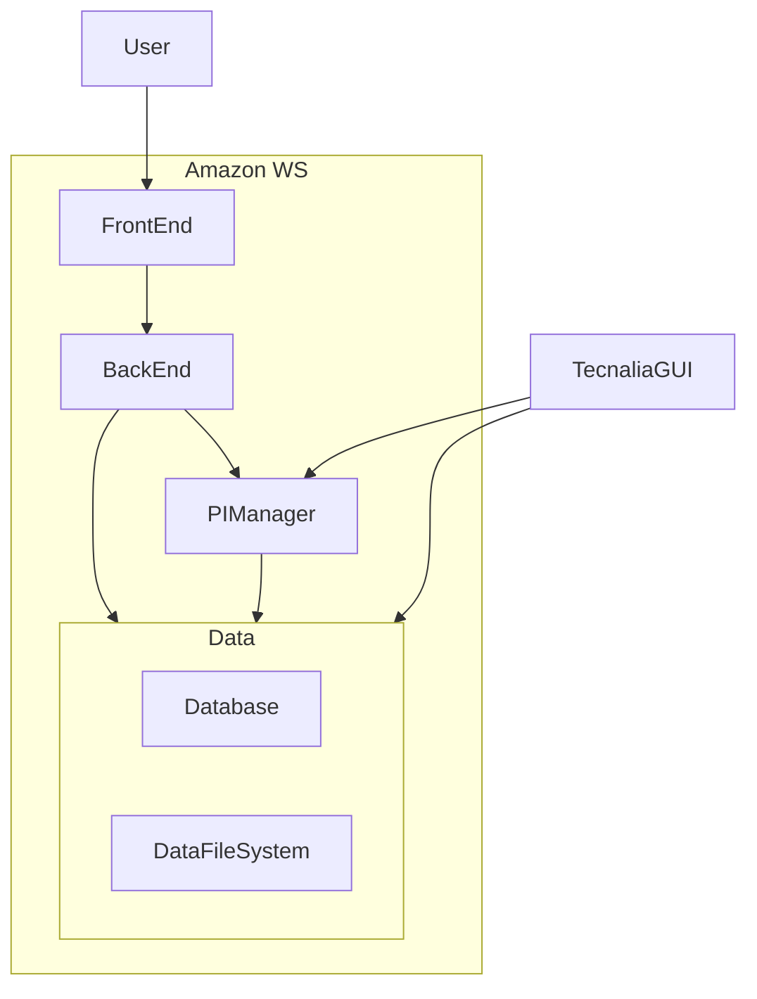

# How to guidelines

Here are compiled some documentation on ow to handle the Eurobench platform.
Some description may need access to other repositories, or special credentials, which will not be placed in this document.

Any request to have deeper access and knowledge to the system should be sent to us by email, or by opening issues on this repository.

## Overall structure

The Eurobench platform is deployed onto a virtual machine currently hosted on a Amazon Web Service.

* The user accesses to the system through the `front end`.
  Implemented using A
* The `front end` relies on the `back end` to interact with the system information.
  Implemented using spring
* The `PI Manager` is in charge of launching and monitoring the computation of the metrics.
  Implemented under python.
* The Eurobench Data is organized through 2 components
  * The database per se that is a `postgreSQL` database.
    Contains all information about protocols, experiments, users, ...
  * The `DataFileSystem` where are stored all experimental files, metric scores, protocol images and manual.

The database, the front-end back-end and the PI Manager are deployed through Docker mechanisms.
That means that all components could be deployed to other environment if required.

## Minimal setup

The `Tecnalia GUI` is an alternative to interact with the Eurobench material.
It does not provide the whole visual experience provided by the official Front-End Back-end system,
but it enables having quick access to the Eurobench Data.
In particular, this GUI permit to:

* add, update and remove a protocol
* add and remove experiment information
* launch metric computation for a given experiment

This minimalist interface can be connected to the official Eurobench machine,
but can be also connected to a local bundle (data and pi manager),
which is very convenient for testing a new protocol before inserting it into the official machine.
It can be also used to debug the metric computation of a given experiment,
if the official platform does not provide sufficiently clear information on the error source.

The `Tecnalia GUI` is provided with the `PI Manager` code, which is still a private git repository.

## Data access and update

### Protocol information

#### How to add a new protocol?

The proposed methodology is inline with the information collected in this document:

* The protocol is described using the excel protocol template (more user friendly)
* From the information provided, a YAML description is generated,
  like the ones contained in folder [data](data).
* The `Tecnalia GUI` is used to upload the protocol into a local database
* The protocol uploaded is tested through the local database, with a experiment sample
* If the computation is satisfactory, the protocol can be uploaded to the official database using the
  `Tecnalia GUI`, and following the smae methodolofy as described above.

We encourage to keep a trace of the generated `YAML` file, together with the related manual, as it is done in this repository, in particular if some updates is required later on.

The preparation of the algorithm, to be compliant with the Eurobench principles, is mandatory.
Documentation provided in **LINK** should be followed.

This process enables to insert the protocol into the database.
But the protocol can be also (or should be) associated with manual (in pdf) or illustrative images.
We are collecting the ones uploaded to the Eurobench platform in this repository.

On the Eurobench platform, this information is stored into the datafile system.
The current methodology is to connect to the Platform machine, and uplaod manually the files into the appropriate folders.

**TO BE BETTER DESCRIBED**.

#### How to update a protocol?

#### How to remove a protocol?

#### How to update a metric?

### Experiment information

#### How to access to experiment data?

#### How to remove an experiment?

### User account

## Machine management

### How to access to the machine?

### How to store / backup the database?

### How to resume the system if down?

### How to resume a backup?

## Here or elsewhere

* How to connect to a local database
* How to connect to the remote database
* Should we comment on hot modification?
* how to clean the database (to get onw without experiments for example)
* how to upload from the Tecnalia GUI an experiment?
  * how is handled the experiment visibility - readyness - owner?
